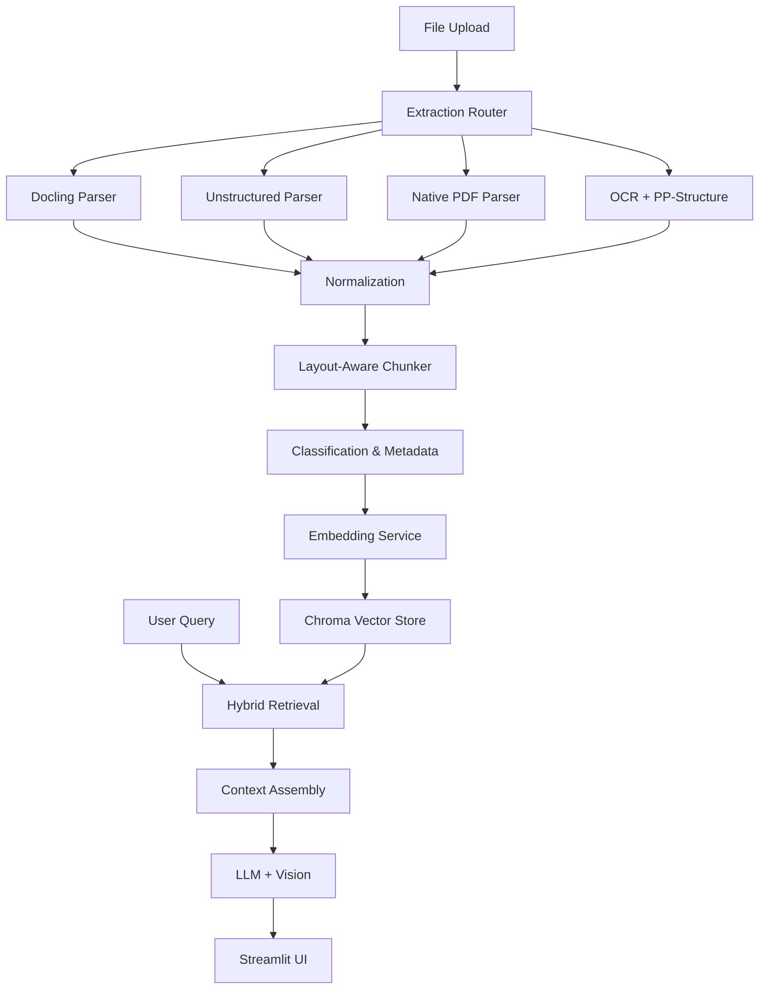

# Design Document

## Overview

The Construction RAG System is a local-first Retrieval-Augmented Generation application built with Streamlit and OpenAI APIs. The system processes mixed construction documents (PDFs, DOCX, XLSX, images) through a multi-stage pipeline: extraction → normalization → chunking → embedding → indexing → hybrid retrieval → LLM answering with citations.

The architecture prioritizes extraction fidelity for complex tables and drawings, layout-aware chunking that preserves document structure, hybrid retrieval combining semantic and keyword search, and transparent citations with source traceability.

## Architecture

### High-Level Pipeline

```
Upload → Multi-Provider Extraction → Normalization → Layout-Aware Chunking → 
Embeddings → Chroma Vector Store → Hybrid Retrieval → LLM Assembly → Streamlit UI
```

### Core Components

1. **Extraction Layer**: Multi-provider document parsing with escalation fallbacks
2. **Chunking Engine**: Layout-aware chunking preserving document structure
3. **Embedding Service**: OpenAI or local SentenceTransformers embeddings
4. **Vector Store**: Chroma database with metadata filtering
5. **Retrieval Engine**: Hybrid dense + BM25 search with optional reranking
6. **QA Assembly**: Context building and citation generation
7. **Vision Service**: Optional image analysis for enhanced answers
8. **Streamlit UI**: Project management, chat interface, and source viewing

### Data Flow



## Components and Interfaces

### Extraction Subsystem

**Base Extractor Interface**
```python
class BaseExtractor:
    def supports(self, file_path: str) -> bool
    def parse_page(self, file_path: str, page_no: int) -> PageParse
    
class PageParse(TypedDict):
    page_no: int
    width: int
    height: int
    blocks: List[Block]
    artifacts_removed: List[str]

class Block(TypedDict):
    type: Literal["paragraph", "heading", "table", "list", "figure", "caption", "artifact", "titleblock", "drawing"]
    text: str
    html: Optional[str]  # For tables
    bbox: List[float]    # [x0, y0, x1, y1]
    spans: List[Span]
    meta: Dict[str, Any]

class Span(TypedDict):
    text: str
    bbox: List[float]
    rot: float
    conf: float
```

**Extraction Providers**

1. **DoclingExtractor**: Advanced layout parsing for PDFs/DOCX/XLSX
   - Converts Docling DOM elements to PageParse format
   - Preserves HTML structure for tables
   - Handles multi-column layouts

2. **UnstructuredExtractor**: ML-based semantic partitioning
   - Uses hi-res strategy with OCR integration
   - Maps Unstructured Elements to Block format
   - Includes page break detection

3. **NativePDFExtractor**: Direct PDF text extraction
   - PyMuPDF for glyph-level text extraction
   - pdfplumber for table detection and line analysis
   - Camelot fallback for complex table structures

4. **OCRExtractor**: PaddleOCR + PP-Structure
   - PaddleOCR for text detection and recognition
   - TableMaster/SLANet for table structure recognition
   - DBSCAN clustering for drawing text regions
   - Confidence scoring and bbox preservation

### Chunking Engine

**Chunker Interface**
```python
class ChunkPolicy(TypedDict):
    target_tokens: int
    max_tokens: int
    preserve_tables: bool
    preserve_lists: bool
    drawing_cluster_text: bool
    drawing_max_regions: int

class Chunk(TypedDict):
    id: str
    text: str
    html: Optional[str]
    metadata: ChunkMetadata
    token_count: int
    text_hash: str

def chunk_page(page: PageParse, policy: ChunkPolicy) -> List[Chunk]
```

**Chunking Rules**
- Headings initiate new chunks and propagate context to children
- Paragraphs remain intact; sentence-boundary splits when needed
- Tables become standalone chunks with header repetition for splits
- Lists grouped with title/intro context preservation
- Drawings default to page-level chunks with optional regional sub-chunks

### Classification and Metadata

**Metadata Schema**
```python
class ChunkMetadata(TypedDict):
    project_id: str
    doc_id: str
    doc_name: str
    file_type: Literal["pdf", "docx", "xlsx", "image"]
    page_start: int
    page_end: int
    content_type: Literal["SpecSection", "Drawing", "ITB", "Table", "List"]
    division_code: Optional[str]
    division_title: Optional[str]
    section_code: Optional[str]
    section_title: Optional[str]
    discipline: Optional[Literal["A", "S", "M", "E", "P", "FP", "EL"]]
    sheet_number: Optional[str]
    sheet_title: Optional[str]
    bbox_regions: List[List[float]]
    low_conf: bool
```

**Classification Heuristics**
- Content type from block types and filename patterns
- Division/section codes via regex on spec headers (MasterFormat divisions 00-48)
- Discipline from sheet number prefixes (A/S/M/E/P/FP/EL)
- Title block extraction for drawing metadata

**MasterFormat Divisions (Complete List)**
```python
MASTERFORMAT_DIVISIONS = {
    "00": "Procurement and Contracting Requirements",
    "01": "General Requirements", 
    "02": "Existing Conditions",
    "03": "Concrete",
    "04": "Masonry",
    "05": "Metals",
    "06": "Wood, Plastics and Composites",
    "07": "Thermal and Moisture Protection",
    "08": "Openings",
    "09": "Finishes",
    "10": "Specialties",
    "11": "Equipment",
    "12": "Furnishings",
    "13": "Special Construction",
    "14": "Conveying Equipment",
    "21": "Fire Suppression",
    "22": "Plumbing",
    "23": "Heating, Ventilating and Air Conditioning (HVAC)",
    "25": "Integrated Automation",
    "26": "Electrical",
    "27": "Communications",
    "28": "Electronic Safety and Security",
    "31": "Earthwork",
    "32": "Exterior Improvements",
    "33": "Utilities",
    "34": "Transportation",
    "35": "Waterway and Marine Construction",
    "40": "Process Integration",
    "41": "Material Processing and Handling Equipment",
    "42": "Process Heating, Cooling and Drying Equipment",
    "43": "Process Gas and Liquid Handling, Purification and Storage Equipment",
    "44": "Pollution and Waste Control Equipment",
    "45": "Industry-Specific Manufacturing Equipment",
    "46": "Water and Wastewater Equipment",
    "48": "Electrical Power Generation"
}
```

### Embedding and Vector Store

**Embedding Service**
```python
class EmbeddingService:
    def embed_texts(self, texts: List[str]) -> List[List[float]]
    def embed_query(self, query: str) -> List[float]

class OpenAIEmbedding(EmbeddingService):
    # Uses text-embedding-3-large
    
class LocalEmbedding(EmbeddingService):
    # Uses SentenceTransformers all-MiniLM-L12-v2
```

**Vector Store Interface**
```python
class VectorStore:
    def upsert_chunks(self, chunks: List[Chunk]) -> None
    def query(self, vector: List[float], k: int, where: Dict) -> List[Hit]
    def delete_project(self, project_id: str) -> None

class Hit(TypedDict):
    id: str
    score: float
    chunk: Chunk
```

### Retrieval Engine

**Search Components**
```python
class HybridRetriever:
    def dense_search(self, query: str, project_context: ProjectContext, k: int, filters: Dict) -> List[Hit]
    def keyword_search(self, query: str, filters: Dict) -> List[Hit]
    def fuse_results(self, dense_hits: List[Hit], keyword_hits: List[Hit], k: int) -> List[Hit]
    def rerank(self, hits: List[Hit], query: str, k: int) -> List[Hit]
    def enhance_query(self, query: str, project_context: ProjectContext) -> str

class BM25Index:
    def index_chunks(self, chunks: List[Chunk]) -> None
    def search(self, query: str, k: int) -> List[Hit]
```

**Project Context Integration**
- Auto-generate project context from document analysis during indexing
- Allow users to edit/refine project context through UI
- Use context to expand queries with relevant construction terminology
- Improve semantic search by providing domain-specific background
- Help disambiguate technical terms based on project type and systems

**Rank Fusion Algorithm**
- Reciprocal Rank Fusion (RRF) for combining dense and BM25 results
- Optional cross-encoder reranking for top-50 → top-k refinement
- Deduplication by section to diversify sources

### QA Assembly

**Context Building**
```python
class ContextPacket(TypedDict):
    chunks: List[Chunk]
    total_tokens: int
    sources: Dict[str, SourceInfo]
    project_context: ProjectContext

class SourceInfo(TypedDict):
    doc_name: str
    page_number: int
    sheet_number: Optional[str]

def build_context(hits: List[Hit], project_context: ProjectContext, max_tokens: int) -> ContextPacket
def enhance_query_with_project_context(query: str, project_context: ProjectContext) -> str
```

**Query Enhancement with Project Context**
- Use project context to expand abbreviations and technical terms
- Add domain-specific context to improve semantic search
- Help LLM understand the construction project scope and focus
- Improve relevance of retrieved chunks by understanding project type

**Citation Generation**
- Numbered source mapping (S1, S2, etc.)
- Document name + page/sheet references
- Expandable snippet display for verification

### Vision Service

**Vision Integration**
```python
class VisionService:
    def get_page_image(self, doc_path: str, page_no: int) -> bytes
    def analyze_with_vision(self, query: str, images: List[bytes], context: str) -> str

class VisionConfig(TypedDict):
    enabled: bool
    max_images: int  # 1-5 chunks
    resolution_scale: float  # 2x for high quality
```

**Vision Workflow**
1. User enables vision assist in UI
2. System retrieves top-k chunks normally
3. For top 1-5 chunks, render corresponding page images
4. Send query + images + text context to OpenAI Vision
5. Always incorporate visual analysis into final answer

## Data Models

### Project Structure
```
storage/
├── project1/
│   ├── raw/                    # Original uploaded files
│   ├── pages/                  # Cached page images (PNG)
│   ├── chunks.jsonl           # Serialized chunks for debug/export
│   ├── project_context.md     # Project summary and context
│   └── chroma/                # Chroma vector database
└── project2/
    └── ...
```

### Project Context System
```python
class ProjectContext(TypedDict):
    project_name: str
    description: str
    project_type: str  # e.g., "Commercial Office Building", "Residential Complex"
    location: Optional[str]
    key_systems: List[str]  # e.g., ["HVAC", "Electrical", "Plumbing"]
    disciplines_involved: List[str]
    summary: str  # Auto-generated or user-provided project overview

def generate_project_context(chunks: List[Chunk]) -> ProjectContext
def enhance_query_with_context(query: str, context: ProjectContext) -> str
```

### Configuration Schema
```yaml
app:
  data_dir: ./storage
  project_cache_size: 3
  max_upload_mb: 100000

llm:
  chat_model: gpt-4o
  embed_model: text-embedding-3-large
  vision_assist: false

embeddings:
  provider: openai  # openai | local
  local_model: all-MiniLM-L12-v2
  batch_size: 64

extract:
  pipeline_priority:
    - docling
    - unstructured_hi_res
    - native_pdf
    - ocr_ppstructure
  languages: ["en"]
  ocr:
    engine: paddleocr
    ppstructure_model: TableMaster
    min_conf: 0.5

chunk:
  target_tokens: 500
  max_tokens: 900
  preserve:
    tables: true
    lists: true
  drawing:
    cluster_text: true
    max_regions: 8

retrieve:
  top_k: 5
  hybrid: true
  reranker: none  # none | cross_encoder
  sliding_window: false
  window_size: 1
```

## Error Handling

### Extraction Failures
- Provider escalation: Docling → Unstructured → Native → OCR
- Graceful degradation with confidence flagging
- Detailed error logging with file/page context
- Continue processing other files on individual failures

### Retrieval Errors
- Fallback to text-only search if vector search fails
- Empty result handling with user feedback
- Timeout protection for long-running queries

### Vision Service Errors
- Automatic fallback to text-only results
- Rate limit handling for OpenAI API
- Image rendering failure recovery

### UI Error States
- Processing progress with cancellation options
- Clear error messages for upload failures
- Graceful handling of configuration errors

## Testing Strategy

### Unit Testing
- Individual extractor components with sample documents
- Chunking logic with various document structures
- Embedding service with mock API responses
- Retrieval algorithms with synthetic data

### Integration Testing
- End-to-end document processing pipeline
- Multi-provider extraction fallback scenarios
- Hybrid retrieval with real document collections
- Vision service integration with sample images

### Acceptance Testing
- Digital table extraction with complex structures
- Scanned document OCR accuracy validation
- Drawing title block parsing verification
- Citation accuracy and source traceability
- Filter functionality across content types
- Vision assist improvement validation

### Performance Testing
- Large document set processing (1000+ pages)
- Concurrent user simulation for retrieval
- Memory usage profiling during indexing
- Response time measurement across query types

## Security Considerations

### Data Privacy
- All document processing remains local
- Only embeddings and queries sent to OpenAI (when enabled)
- No persistent storage of API responses
- Local embedding option for complete offline operation

### Input Validation
- File type and size validation on upload
- Malicious PDF protection through parser sandboxing
- Query sanitization for injection prevention
- Configuration parameter bounds checking

### Error Information
- Sanitized error messages without sensitive data
- Logging controls to prevent data leakage
- Secure temporary file handling during processing